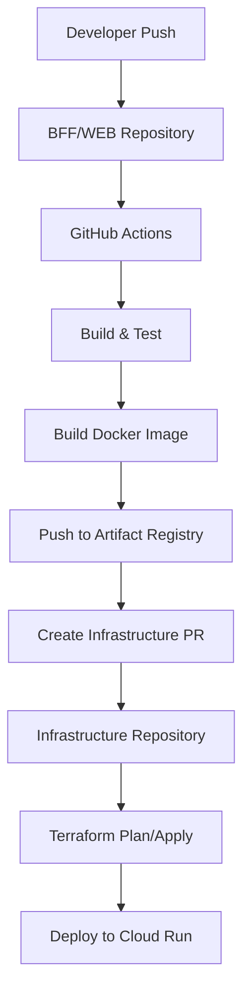

# 🔄 GitOps Workflow - Death Star Infrastructure

Este documento descreve o fluxo completo de GitOps implementado para a infraestrutura Death Star.

## 🏗️ Arquitetura do Workflow



## 📦 Repositórios Envolvidos

### 1. 🏗️ death-star-infrastructure
**Função**: Repositório central de infraestrutura
- Contém configurações Terraform
- Gerencia deploy automático via GitOps
- Pipeline executa terraform plan/apply

### 2. 🔧 death-star-command-core (BFF)
**Função**: Backend for Frontend
- Build automático da aplicação Go
- Geração de imagem Docker
- Criação automática de PR no repositório de infraestrutura

### 3. 🌐 death-star-bridge-ui (WEB)
**Função**: Frontend Next.js
- Build automático da aplicação
- Geração de imagem Docker
- Criação automática de PR no repositório de infraestrutura

## 🔄 Fluxo de Deploy

### 1. Desenvolvimento
```bash
# Developer faz push para main do BFF ou WEB
git push origin main
```

### 2. Build e Push da Imagem
- GitHub Actions executa tests
- Build da imagem Docker
- Push para Google Artifact Registry
- Geração de SLSA provenance (Level 3)

### 3. GitOps - Atualização da Infraestrutura
- Script automaticamente:
  - Faz checkout do repositório de infraestrutura
  - Atualiza a tag da imagem no `cloudrun.tf`
  - Cria um Pull Request automático

### 4. Review e Deploy
- PR é criado com todas as informações
- Review manual (opcional)
- Merge automático ou manual
- Terraform apply executa automaticamente

## 🔧 Configuração de Secrets

### Repositórios BFF e WEB precisam:
```bash
# Google Cloud Service Account
GCP_SA_KEY=<service-account-json>

# Token para acessar repositório de infraestrutura
INFRASTRUCTURE_PAT=<github-personal-access-token>
```

### Repositório de Infraestrutura precisa:
```bash
# Google Cloud Service Account
GCP_SA_KEY=<service-account-json>
```

## 🎯 Recursos dos Workflows

### 🔒 Segurança
- **SLSA Level 3 Provenance**: Rastreabilidade completa
- **Least Privilege**: Permissões mínimas necessárias
- **Secrets Management**: Uso de GitHub Secrets

### 📊 Observabilidade
- **Summaries**: Resumos detalhados de cada deploy
- **PR Comments**: Terraform plans nos comentários
- **Notifications**: Alertas em caso de falha

### 🚀 Automação
- **Build automático**: Triggered por push
- **Tests**: Execução automática de testes
- **GitOps**: PRs automáticos para infraestrutura
- **Deploy**: Terraform apply automático

## 📋 Comandos Úteis

### Verificar status dos serviços
```bash
gcloud run services list --region=us-central1
```

### Ver logs de deploy
```bash
# Logs do Cloud Run
gcloud logs read "resource.type=cloud_run_revision" --limit=50

# Logs do GitHub Actions
gh run list --repo=project-death-star/death-star-infrastructure
```

### Rollback manual
```bash
# Reverter para versão anterior no Git
git revert HEAD
git push origin main

# Ou atualizar tag da imagem manualmente
git checkout -b rollback/service-name
# Editar cloudrun.tf
git commit -m "Rollback service-name to previous version"
git push origin rollback/service-name
# Criar PR
```

## 🛠️ Troubleshooting

### Build falhando
1. Verificar logs do GitHub Actions
2. Conferir secrets configurados
3. Validar Dockerfile
4. Verificar permissões do service account

### PR não sendo criado
1. Verificar `INFRASTRUCTURE_PAT` token
2. Conferir permissões do token
3. Validar nome do repositório
4. Verificar branch main existe

### Terraform apply falhando
1. Verificar estado do Terraform
2. Conferir permissões GCP
3. Validar configurações
4. Verificar se imagem existe no registry

## 🎉 Benefícios do GitOps

- ✅ **Rastreabilidade**: Todo deploy tem PR associado
- ✅ **Reversibilidade**: Fácil rollback via Git
- ✅ **Auditoria**: Histórico completo no Git
- ✅ **Automação**: Reduz erros humanos
- ✅ **Segurança**: Review process obrigatório
- ✅ **Consistência**: Mesma forma para todos os serviços

---

**🚀 Happy GitOps-ing!**